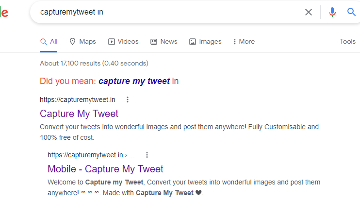

# web-elements/meta

### the ultimate meta boilerplate you need

## Need of `meta` tags

information you use to tell the search engines and those viewing your site more about your page and the information it contains thus they are vital for SEO

## boilerplate

add these into `head` of your website

```html
<meta charset="UTF-8" />
<meta name="viewport" content="width=device-width, initial-scale=1.0" />
<meta name="description" content="description-of-your-site" />
<meta name="keywords" content="site-keywords-seprated by comma" />
<meta name="author" content="author-name" />
<title>title-goes-here</title>
<meta name="title" content="title-goes-here" />
<link rel="icon" href="url-to-favicon.ico" />
<meta name="robots" content="index, follow" />
<meta http-equiv="Content-Type" content="text/html; charset=utf-8" />
<meta name="language" content="English" />
<meta name="theme-color" content="theme-color-of-website" />
<meta property="og:type" content="website" />
<meta property="og:url" content="url-of-website" />
<meta property="og:title" content="title-goes-here" />
<meta property="og:description" content="description-of-your-site" />
<meta property="og:image" content="url-to-og-image" />
<meta property="twitter:card" content="summary_large_image" />
<meta property="twitter:url" content="url-of-website" />
<meta property="twitter:title" content="title-goes-here" />
<meta property="twitter:description" content="description-of-your-site" />
<meta property="twitter:image" content="url-to-og-image" />
<!-- links-to-favicons  here maybe generated online or offeline -->
<link rel="manifest" href="/site.webmanifest" />
```

in here `og:` are open graph
you can create them here too
https://freecodetools.org/ogp/

### `manifest` in `meta` is not important

The web app manifest is a JSON file that tells the browser about your Web App and how it should behave when installed on the user's desktop or mobile device.

### examples of how they help




### thanks of using this repo


